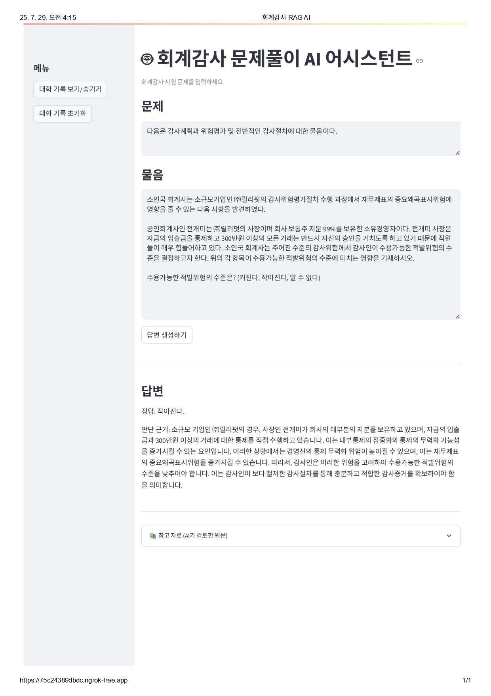

# 회계감사 사례문제 풀이 AI 어시스턴트 (Audit Case Solver AI Assistant)
공인회계사 2차 시험의 회계감사 사례형 문제를 입력하면, RAG(Retrieval-Augmented Generation) 아키텍처 기반의 LLM이 벡터 검색을 통해 관련 기준서 내용을 로드하고, 정답 및 판단 근거를 생성해 출력하는 Streamlit 기반의 질의응답 시스템입니다.

---

## 프로젝트 개요

이 프로젝트는 회계감사 2차시험 대비 교재 및 목차 파일을 학습 데이터로 활용해,  
**문서 검색 + LLM 응답 생성을 결합한 RAG 파이프라인**을 구축하는 것을 목표로 합니다.

사용자는 복잡한 회계감사 문제의 상황과 물음을 입력하고,  
시스템은 FAISS 벡터스토어에서 의미 기반으로 관련 chunk를 검색한 뒤,  
**GPT-4o 모델을 통해 정답과 그에 대한 판단 근거를 구조화된 형태로 반환합니다.**

---

## 회계감사 AI 어시스턴트 UI 미리보기

아래는 실제 웹 앱에서 문제와 물음을 입력하고, 정답 및 판단 근거를 생성한 화면 예시입니다:

---

## 주요 기능

- **RAG 기반 질의응답**  
  LangChain과 GPT-4o를 활용해, 문서의 내용을 기반으로 정답과 그 근거를 생성합니다.

- **문맥 유사도 검색**  
  FAISS Vector Store를 활용해 사용자의 질문과 가장 관련 있는 chunk를 검색합니다.

- **프롬프트 최적화**  
  '정답'과 '판단 근거'를 분리 생성하도록 명확하게 설계된 Prompt Template을 사용합니다.

- **분리 입력 UI**  
  Streamlit 웹 인터페이스에서 ‘문제’와 ‘물음’을 **개별 입력창**에 입력받고, 하나의 쿼리로 조합합니다.

- **대화 기록 관리 기능**  
  - 기록 보기/숨기기  
  - 전체 대화 HTML로 저장 (시간 및 스타일 포함)  
  - 현재 세션 기록 초기화

---

## 🛠️ 기술 스택

| 영역 | 기술 |
|------|------|
| AI / RAG | `LangChain`, `GPT-4o`, `FAISS`, `PromptTemplate` |
| 전처리 | `PyMuPDF`, `Camelot`, `Tesseract OCR`, `Pandas` |
| 프론트엔드 | `Streamlit`, `Colab`, `Ngrok` |
| 저장 구조 | `.txt` 저장 + 벡터 DB (`03_vector_store/`) |

---

## 시스템 아키텍처

### 1. 데이터 전처리 파이프라인 (`1_data_processing.ipynb`)

1. `01_source_pdfs/` 폴더의 PDF 문서에서 **텍스트와 표**를 추출  
   - `PyMuPDF`: 일반 텍스트 추출  
   - `Camelot`: 표 데이터 추출 (OpenCV 기반)  
   - `Tesseract OCR`: 텍스트가 거의 없는 페이지에서 이미지 기반 추출

2. 정제 후 결과물을 `02_cleaned_text/`에 저장

3. LangChain의 `RecursiveCharacterTextSplitter`로 문서를 의미 단위로 분할 (chunking)

4. `OpenAIEmbeddings`를 통해 각 chunk를 벡터화하고 `FAISS` DB로 저장 (`03_vector_store/`)

---

### 2. Streamlit RAG 애플리케이션 (`2_app_runner.ipynb`)

- **Colab 환경에서 API 키 관리**: `userdata.get()`으로 키를 불러와 `.streamlit/secrets.toml` 생성
- `app.py`에 다음 요소 포함:

1. **벡터 DB 로딩 및 RAG 체인 구성**  
   - GPT-4o + FAISS  
   - `RetrievalQA` 체인에 prompt template 주입

2. **프롬프트 템플릿**  
   - '정답:', '판단 근거:' 양식으로 답변 생성 강제  
   - 기준 문구를 그대로 인용하며, 절차 적정성·위반 여부 등을 논리적으로 판단

3. **Streamlit UI 구성**  
   - 문제 / 물음 입력창 분리  
   - 답변 생성 버튼 → GPT 호출  
   - 결과: 정답, 판단 근거, 관련 문서 chunk 출력  
   - 대화 기록 저장 기능 (HTML with CSS)

